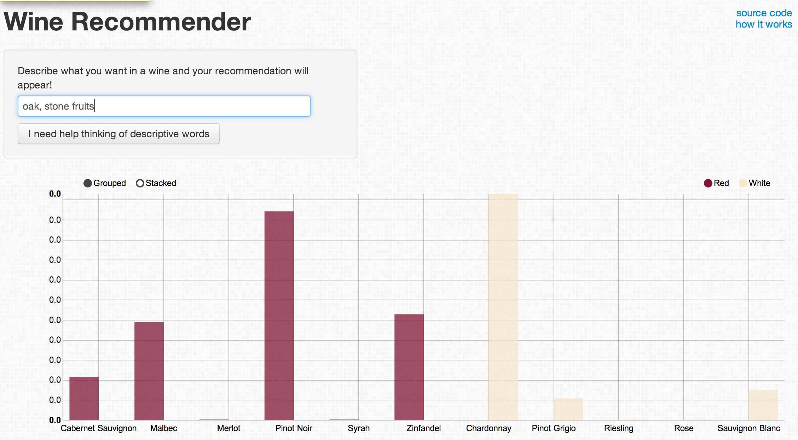

# sommelieR

sommelieR is a [shiny app](https://github.com/rstudio/shiny) written in R, which takes words scraped from thousands of wine reviews written on [Wine Spectator](www.winespectator.com) and uses a Naive Bayesian model to determine the most likely posterior probability given user-inputed text. 

## Example

Using sommelieR is easy, just think of some descriptive words that describe a wine you would like to drink and the chart will update automatically with each new word. The text box allows for you to write in sentences or just list words, so don't worry about conforming to a specific format. 

