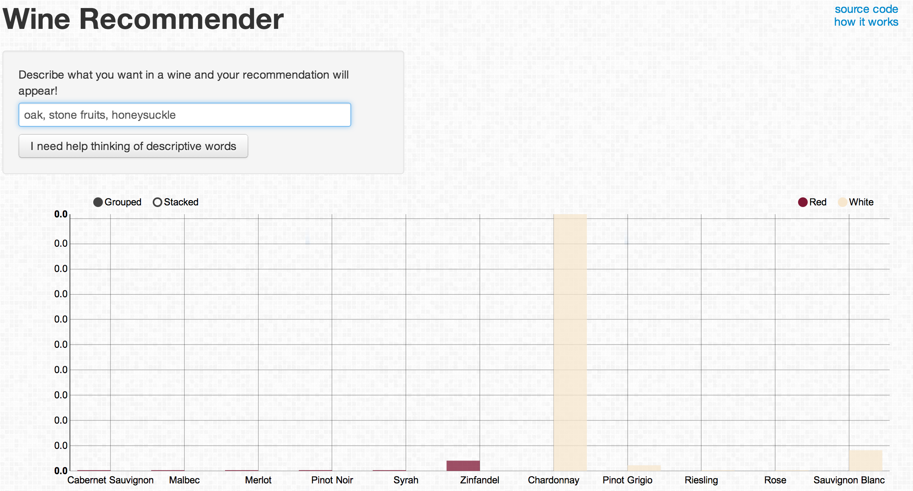

# sommelieR

sommelieR is a [shiny app](https://github.com/rstudio/shiny) written in R, which takes words scraped from thousands of wine reviews written on [Wine Spectator](www.winespectator.com) and uses a Naive Bayesian model to determine the most likely posterior probability given user-inputed text. 

## Example

Using sommelieR is easy, just think of some descriptive words that describe a wine you would like to drink and the chart will update automatically with each new word. The text box allows for you to write in sentences or just list words, so don't worry about conforming to a specific format. 

For example, when we type `oak, stone fruits`, the model recognizes these words as most likely coming from either a description of a Pinot Noir or a Chardonnay.

But when we add `honeysuckle` to the description, it becomes quite clear that we are describing a Chardonnay!

## More info / License / Thanks

Contact me if you would like to know any further information. I'm happy to share the code I used to scrape and process the WineSpectator reviews or give away the full dataset, which has additional information in it like price, rating, and full wine name and description.  

The Bayesian model used was inspired by a chapter in Machine Learning for Hackers. 
